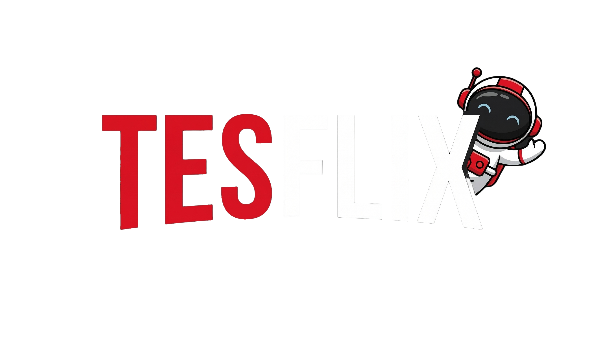

<p align="center">
  
</p>

<p align="center">
  A self-hosted static dashboard designed for the Tesla browser — launch all your homelab and streaming apps in fullscreen with a single tap.
</p>

<p align="center">
  
  
  
  
  
</p>

---

## How it works

Tesla's browser can open any URL fullscreen using a YouTube redirect trick. Tesflix wraps every app link with:

```
https://www.youtube.com/redirect?q=<your-url>
```

This is applied automatically at build time — you just add URLs to the config file.

## Stack

| Layer | Technology |
|---|---|
| Framework | Astro 5 (SSG) |
| Interactive islands | Svelte 5 (Clock, URL Launcher) |
| Styling | Tailwind CSS 4 + DaisyUI 5 |
| Config | YAML parsed at build time with `js-yaml` |
| Logo color extraction | `sharp` (dominant color from logo image) |
| Runtime | Bun |

## Getting started

```bash
# Install dependencies
bun install

# Start dev server
bun dev

# Build static output → /dist
bun run build

# Preview build
bun run preview
```

## Configuration

Edit `src/data/config.yml` to add, remove or reorganize apps. No code changes needed.

```yaml
categories:
  - name: Streaming
    apps:
      - name: Netflix
        url: https://www.netflix.com
        logo: /logos/netflix.png   # local path or remote URL
        color: "#E50914"           # optional — auto-extracted from logo if omitted
```

### Logo sources

- **Local:** place PNG/SVG files in `public/logos/` and reference them as `/logos/filename.png`
- **Remote:** use any direct image URL (fetched at build time)
- **Auto color:** if `color` is omitted, the dominant color is extracted from the logo automatically

## Features

- **Fullscreen launcher** — every app opens fullscreen via the Tesla YouTube redirect
- **Glassmorphism UI** — dark theme with backdrop blur and per-app color glow
- **Spotlight effect** — radial gradient follows cursor/finger on each card
- **Category drag & drop** — reorder categories by dragging the handle; order persists in `localStorage`
- **URL launcher** — type any URL and open it fullscreen instantly
- **Live clock** — updates every second
- **Touch optimized** — all interactions work on the Tesla touchscreen
- **Zero JS for static content** — cards and layout are pure HTML, JS only loads for interactive islands

## Project structure

```
tesflix/
├── public/
│   └── logos/          ← App logos (PNG, SVG)
├── src/
│   ├── components/
│   │   ├── Clock.svelte
│   │   └── UrlLauncher.svelte
│   ├── data/
│   │   └── config.yml  ← Edit this to configure your apps
│   └── pages/
│       └── index.astro
├── astro.config.mjs
└── package.json
```
